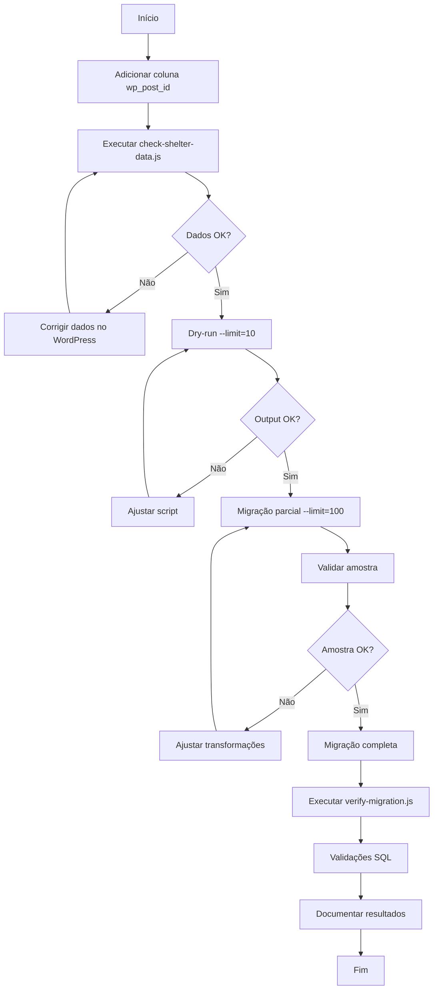

# 🏠 Plano de Migração: Abrigos (WordPress → Supabase)

## 📋 Sumário Executivo

Este documento define o plano completo de migração dos dados legados de **abrigos** do WordPress para as novas tabelas do Supabase, seguindo o mesmo padrão já estabelecido na migração de voluntários.

**Data de Criação:** 2025-12-29
**Status:** Planejamento
**Responsável:** Equipe de Desenvolvimento

---

## 🎯 Objetivos

1. Migrar dados de abrigos da tabela `wp_posts_raw` (post_type='abrigo') para a tabela `shelters`
2. Preservar todos os metadados relevantes (tipo, localização, dados de fundação, etc.)
3. Manter rastreabilidade com o sistema legado via `wp_post_id`
4. Garantir idempotência (poder executar múltiplas vezes sem duplicação)
5. NÃO criar usuários automaticamente (vincular posteriormente no primeiro login)

---

## 📊 Análise da Estrutura Atual

### 1. Tabela Legada: `wp_posts_raw`

**Filtro:** `post_type = 'abrigo'`

**Campos relevantes:**
```typescript
{
  id: number;                    // Identificador único do WordPress
  post_author: string;           // ID do autor (usuário WordPress)
  post_date: string;             // Data de criação (YYYY-MM-DD HH:mm:ss)
  post_title: string;            // Nome do abrigo
  post_content: string;          // Conteúdo/descrição (geralmente vazio)
  post_status: string;           // 'publish', 'draft', etc.
  post_name: string;             // Slug do post (URL-friendly)
  post_modified: string;         // Data de última modificação
}
```

### 2. Tabela Legada: `wp_postmeta_raw`

**Metadados dos abrigos:**

| meta_key | Descrição | Exemplo |
|----------|-----------|---------|
| `estado` | Estado (UF) | "SC", "RR", "SP" |
| `tipo` | Tipo do abrigo | "Público", "Privado", "Misto", "LT-PI" |
| `endereco` | Endereço completo | "Rua ABC, 123" |
| `cidade` | Nome da cidade | "Florianópolis" |
| `website` | URL do site | "https://exemplo.com" |
| `fundacao` | Data de fundação | "20/11/2017" (DD/MM/YYYY) |
| `cnpj` | CNPJ do abrigo | "12.345.678/0001-90" |
| `cpf` | CPF (para LT/PI) | "123.456.789-00" |

**Observação:** Nem todos os abrigos possuem todos os metadados preenchidos.

### 3. Tabela Nova: `shelters` (Supabase)

**Estrutura completa:**
```typescript
{
  // Identificação
  id: string;                          // UUID (gerado automaticamente)
  wp_post_id?: number;                 // 🔑 NOVO: ID do post legado (rastreabilidade)
  profile_id?: string;                 // FK para profiles (NULL inicialmente)

  // Tipo e Documentação
  shelter_type?: string;               // "public" | "private" | "mixed" | "temporary"
  cnpj?: string;                       // CNPJ do abrigo
  cpf?: string;                        // CPF (para LT/PI)

  // Dados Básicos
  name?: string;                       // Nome do abrigo

  // Endereço
  cep?: string;                        // CEP
  street?: string;                     // Rua
  number?: number;                     // Número
  district?: string;                   // Bairro
  state?: string;                      // Estado (UF)
  city?: string;                       // Cidade

  // Informações Adicionais
  website?: string;                    // URL do site
  foundation_date?: string;            // Data de fundação (YYYY-MM-DD)

  // Espécies
  species?: string;                    // "caes" | "gatos" | "caes e gatos"
  additional_species?: Json;           // Array JSON: ["coelhos", "aves", ...]

  // Para abrigos temporários
  temporary_agreement?: string;        // Info de acordo temporário

  // População Inicial
  initial_dogs?: number;               // Número inicial de cães
  initial_cats?: number;               // Número inicial de gatos

  // Responsável Autorizado
  authorized_name?: string;            // Nome do responsável
  authorized_role?: string;            // "Gestor" | "Funcionário" | "Voluntário"
  authorized_email?: string;           // Email do responsável
  authorized_phone?: string;           // Telefone do responsável

  // Status
  active?: boolean;                    // Se está ativo (default: true)
  accept_terms?: boolean;              // Aceitou termos (default: true para migrados)

  // Auditoria (gerenciados automaticamente)
  created_at: string;                  // Data de criação
  updated_at: string;                  // Data de atualização
}
```

---

## 🗺️ Mapeamento de Dados

### Campos Básicos (wp_posts → shelters)

| Origem (WordPress) | Destino (Supabase) | Transformação |
|-------------------|-------------------|---------------|
| `id` | `wp_post_id` | Direto (number) |
| `post_author` | ❌ NÃO migrado | Será usado apenas para vínculo futuro |
| `post_title` | `name` | Trim + validação não-vazio |
| `post_name` | ❌ NÃO migrado | Slug não necessário na tabela shelters |
| `post_status` | ❌ NÃO migrado | Todos migrados são considerados ativos |
| `post_date` | `created_at` | Parseado para ISO 8601 |
| `post_modified` | `updated_at` | Parseado para ISO 8601 |

### Metadados (wp_postmeta → shelters)

| meta_key (WordPress) | Campo (Supabase) | Transformação |
|---------------------|-----------------|---------------|
| `tipo` | `shelter_type` | Mapeamento:<br>• "Público" → "public"<br>• "Privado" → "private"<br>• "Misto" → "mixed"<br>• "LT-PI" → "temporary" |
| `cnpj` | `cnpj` | Normalizar (apenas números, validar formato) |
| `cpf` | `cpf` | Normalizar (apenas números, validar formato) |
| `estado` | `state` | Uppercase, validar UF |
| `cidade` | `city` | Trim, normalizar |
| `endereco` | `street` | Extrair rua (parsing básico) |
| ❌ N/A | `number` | NULL (não existe no legado) |
| ❌ N/A | `district` | NULL (não existe no legado) |
| ❌ N/A | `cep` | NULL (não existe no legado) |
| `website` | `website` | Trim, validar URL |
| `fundacao` | `foundation_date` | Converter DD/MM/YYYY → YYYY-MM-DD |

### Campos com Valores Padrão

| Campo (Supabase) | Valor Padrão | Justificativa |
|-----------------|-------------|---------------|
| `profile_id` | `NULL` | Será vinculado no primeiro login |
| `active` | `true` | Abrigos migrados são considerados ativos |
| `accept_terms` | `true` | Assumir aceite para dados migrados |
| `species` | `NULL` | Não existe no legado |
| `additional_species` | `NULL` | Não existe no legado |
| `temporary_agreement` | `NULL` | Não existe no legado |
| `initial_dogs` | `NULL` | Não existe no legado (será preenchido manualmente) |
| `initial_cats` | `NULL` | Não existe no legado (será preenchido manualmente) |
| `authorized_name` | `NULL` | Não existe no legado |
| `authorized_role` | `NULL` | Não existe no legado |
| `authorized_email` | `NULL` | Não existe no legado |
| `authorized_phone` | `NULL` | Não existe no legado |

---

## ⚙️ Implementação

### Fase 1: Preparação do Banco

#### 1.1. Adicionar coluna `wp_post_id` à tabela `shelters`

**Arquivo SQL:** `scripts/migrations/abrigos/add-wp-post-id-column.sql`

```sql
-- Adiciona coluna wp_post_id se não existir
DO $$
BEGIN
  IF NOT EXISTS (
    SELECT 1 FROM information_schema.columns
    WHERE table_name = 'shelters' AND column_name = 'wp_post_id'
  ) THEN
    ALTER TABLE shelters
    ADD COLUMN wp_post_id INTEGER UNIQUE;

    COMMENT ON COLUMN shelters.wp_post_id IS 'ID do post legado do WordPress (para rastreabilidade)';
  END IF;
END $$;

-- Criar índice para performance
CREATE INDEX IF NOT EXISTS idx_shelters_wp_post_id
ON shelters(wp_post_id)
WHERE wp_post_id IS NOT NULL;
```

**Comando:**
```bash
# Executar via Supabase CLI ou SQL Editor
psql -h [host] -U postgres -d postgres -f scripts/migrations/abrigos/add-wp-post-id-column.sql
```

### Fase 2: Script de Migração Principal

#### 2.1. Script: `migrate-shelters-wp-to-supabase.js`

**Características:**
- ✅ **Idempotente** - Usa `upsert` com `onConflict: 'wp_post_id'`
- ✅ **Paginação** - Processa em lotes de 500 registros
- ✅ **Validação** - Valida dados obrigatórios antes de inserir
- ✅ **Normalização** - Normaliza telefones, estados, documentos
- ✅ **Dry-run** - Permite simular sem alterar dados
- ✅ **Relatório** - Gera JSON com estatísticas

**Estrutura:**
```javascript
/**
 * Script de Migração: Abrigos (WordPress → Supabase)
 */

// 1. Configuração
const BATCH_SIZE = 200;
const PAGE_SIZE = 500;

// 2. Funções de Normalização
function normalizeShelterType(tipo) {
  const map = {
    'Público': 'public',
    'Privado': 'private',
    'Misto': 'mixed',
    'LT-PI': 'temporary',
    'LT/PI': 'temporary'
  };
  return map[tipo] || null;
}

function normalizeFoundationDate(dateStr) {
  // Converte DD/MM/YYYY → YYYY-MM-DD
  if (!dateStr) return null;
  const parts = dateStr.split('/');
  if (parts.length === 3) {
    const [day, month, year] = parts;
    return `${year}-${month.padStart(2, '0')}-${day.padStart(2, '0')}`;
  }
  return null;
}

// 3. Função de Mapeamento
function mapLegacyShelterToNew(wpPost, metaArray) {
  const name = wpPost.post_title || null;
  const tipo = extractMeta(metaArray, 'tipo');
  const shelterType = normalizeShelterType(tipo);
  const estado = normalizeState(extractMeta(metaArray, 'estado'));
  const cidade = normalizeText(extractMeta(metaArray, 'cidade'));
  const endereco = normalizeText(extractMeta(metaArray, 'endereco'));
  const website = normalizeText(extractMeta(metaArray, 'website'));
  const fundacao = normalizeFoundationDate(extractMeta(metaArray, 'fundacao'));
  const cnpj = normalizeDocument(extractMeta(metaArray, 'cnpj'));
  const cpf = normalizeDocument(extractMeta(metaArray, 'cpf'));

  const createdAt = parseWpDate(wpPost.post_date);
  const updatedAt = parseWpDate(wpPost.post_modified);

  return {
    wp_post_id: wpPost.id,
    profile_id: null,
    shelter_type: shelterType,
    cnpj,
    cpf,
    name,
    state: estado,
    city: cidade,
    street: endereco,
    website,
    foundation_date: fundacao,
    active: true,
    accept_terms: true,
    created_at: createdAt,
    updated_at: updatedAt,
  };
}

// 4. Validação
function validateShelter(shelter) {
  if (!shelter.wp_post_id) {
    return { ok: false, reason: 'wp_post_id ausente' };
  }
  if (!shelter.name || shelter.name.trim().length === 0) {
    return { ok: false, reason: 'name ausente ou vazio' };
  }
  return { ok: true };
}

// 5. Busca de Dados Legados
async function fetchLegacyShelters(offset = 0, pageSize = PAGE_SIZE) {
  const { data: posts } = await supabase
    .from('wp_posts_raw')
    .select('*')
    .eq('post_type', 'abrigo')
    .order('id', { ascending: true })
    .range(offset, offset + pageSize - 1);

  const postIds = posts.map(p => p.id);
  const { data: metas } = await supabase
    .from('wp_postmeta_raw')
    .select('*')
    .in('post_id', postIds);

  const metasByPostId = groupBy(metas, 'post_id');

  return posts.map(post => ({
    post,
    metas: metasByPostId[post.id] || [],
  }));
}

// 6. Upsert
async function upsertShelters(shelters) {
  const { data, error } = await supabase
    .from('shelters')
    .upsert(shelters, {
      onConflict: 'wp_post_id',
      ignoreDuplicates: false,
    })
    .select('id, wp_post_id');

  return { updated: data?.length || shelters.length };
}

// 7. Main
async function main() {
  // Contar total
  // Processar em lotes
  // Validar e transformar
  // Upsert
  // Gerar relatório
}
```

**Parâmetros CLI:**
```bash
# Dry-run
node migrate-shelters-wp-to-supabase.js --dry-run --limit=10

# Migração parcial
node migrate-shelters-wp-to-supabase.js --limit=100

# Migração completa
node migrate-shelters-wp-to-supabase.js
```

### Fase 3: Scripts Auxiliares

#### 3.1. `check-shelter-data.js`
Verifica a qualidade dos dados antes da migração.

**Funcionalidades:**
- Contar total de abrigos no legado
- Listar abrigos sem nome
- Listar metadados ausentes (estado, tipo, cidade)
- Verificar formatos de CNPJ/CPF
- Verificar formatos de data de fundação

#### 3.2. `verify-migration.js`
Valida se a migração foi bem-sucedida.

**Funcionalidades:**
- Comparar contagem legado vs. Supabase
- Verificar duplicatas por `wp_post_id`
- Verificar abrigos sem `name`
- Listar amostra aleatória para validação manual

---

## 📋 Checklist de Execução

### Pré-Migração

- [ ] Adicionar coluna `wp_post_id` à tabela `shelters`
- [ ] Criar índice em `shelters.wp_post_id`
- [ ] Executar `check-shelter-data.js` para analisar qualidade dos dados
- [ ] Revisar relatório de qualidade de dados
- [ ] Fazer backup do banco de dados

### Migração

- [ ] Executar dry-run com limite pequeno (10 registros)
- [ ] Revisar output do dry-run
- [ ] Executar migração parcial (100 registros)
- [ ] Validar dados migrados no Supabase
- [ ] Executar migração completa
- [ ] Gerar relatório final

### Pós-Migração

- [ ] Executar `verify-migration.js`
- [ ] Comparar contagens (SQL queries)
- [ ] Verificar ausência de duplicatas
- [ ] Validar amostra aleatória de 20 abrigos
- [ ] Documentar estatísticas finais
- [ ] Arquivar relatórios de migração

---

## 📊 Validações SQL

### 1. Contagem Total
```sql
-- Total migrado
SELECT COUNT(*) as total_migrado
FROM shelters
WHERE wp_post_id IS NOT NULL;

-- Total no legado
SELECT COUNT(*) as total_legado
FROM wp_posts_raw
WHERE post_type = 'abrigo';
```

### 2. Verificar Duplicatas
```sql
-- Não deve retornar nenhum registro
SELECT wp_post_id, COUNT(*) as duplicatas
FROM shelters
WHERE wp_post_id IS NOT NULL
GROUP BY wp_post_id
HAVING COUNT(*) > 1;
```

### 3. Abrigos sem Nome
```sql
SELECT id, wp_post_id, name
FROM shelters
WHERE wp_post_id IS NOT NULL
  AND (name IS NULL OR name = '');
```

### 4. Distribuição por Tipo
```sql
SELECT
  shelter_type,
  COUNT(*) as total
FROM shelters
WHERE wp_post_id IS NOT NULL
GROUP BY shelter_type
ORDER BY total DESC;
```

### 5. Distribuição por Estado
```sql
SELECT
  state,
  COUNT(*) as total
FROM shelters
WHERE wp_post_id IS NOT NULL
GROUP BY state
ORDER BY total DESC;
```

### 6. Abrigos com profile_id vinculado
```sql
-- Deve retornar 0 logo após a migração
SELECT COUNT(*)
FROM shelters
WHERE wp_post_id IS NOT NULL
  AND profile_id IS NOT NULL;
```

---

## ⚠️ Considerações Importantes

### 1. Vínculo com Usuários

**Não será feito na migração:**
- ❌ Não criar usuários em `auth.users`
- ❌ Não criar perfis em `profiles`
- ❌ Não vincular `shelters.profile_id`

**Será feito posteriormente:**
- ✅ No primeiro login do usuário, o sistema irá:
  1. Autenticar via Supabase Auth
  2. Criar registro em `profiles`
  3. Buscar abrigo por `post_author` do WordPress
  4. Vincular `shelters.profile_id = auth.uid()`

### 2. Dados Ausentes no Legado

Os seguintes campos **não existem** no WordPress e ficarão NULL:
- `cep`, `number`, `district` (endereço detalhado)
- `species`, `additional_species` (espécies atendidas)
- `initial_dogs`, `initial_cats` (população inicial)
- `authorized_*` (dados do responsável)

**Solução:** Usuários preencherão via formulário "Meu Cadastro" após o login.

### 3. Migração de Dinâmicas Populacionais

**NÃO faz parte deste plano:**
- Migração de `post_type = 'dinamica'` → `shelter_dynamics`
- Migração de `post_type = 'dinamica_lar'` → `shelter_dynamics`

**Será feito em plano separado** após conclusão da migração de abrigos.

---

## 🔄 Fluxo Completo de Migração



---

## 📝 Próximos Passos (Pós-Migração)

1. **Migração de Dinâmicas Populacionais**
   - Plano separado para `dinamica` e `dinamica_lar`
   - Vincular com abrigos via `id_abrigo` (meta)

2. **Sistema de Auto-Vínculo no Login**
   - Implementar lógica de auto-link em `auth hooks`
   - Buscar abrigo por `post_author` do WordPress
   - Atualizar `shelters.profile_id`

3. **Testes de Login**
   - Criar script `setup-test-login.js` para abrigos
   - Testar fluxo completo de login → vínculo

4. **Atualização da Documentação**
   - Atualizar README.md da pasta migrations
   - Documentar estatísticas finais

---

## 📚 Referências

- [Migração de Voluntários](../voluntarios/migrate-volunteers-wp-to-supabase.js) - Padrão de referência
- [Schema Supabase](../../../src/lib/supabase/types.ts) - Tipos do banco
- [Formulário de Cadastro](../../../src/app/(protected)/meu-cadastro/components/ShelterProfileForm.tsx) - Validações

---

**Última atualização:** 2025-12-29
**Versão:** 1.0
**Status:** ✅ Planejamento Concluído
